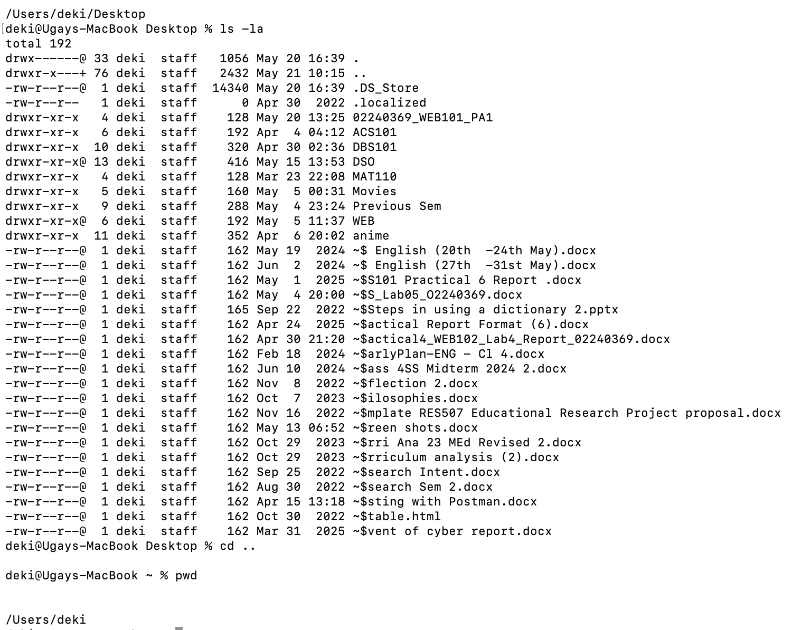
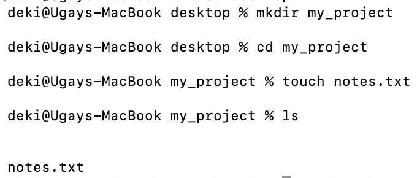
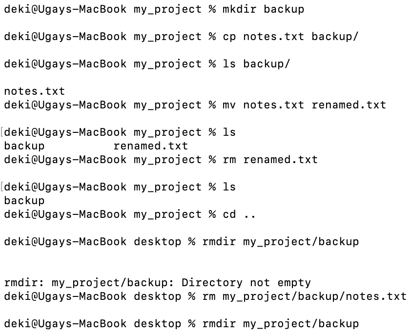
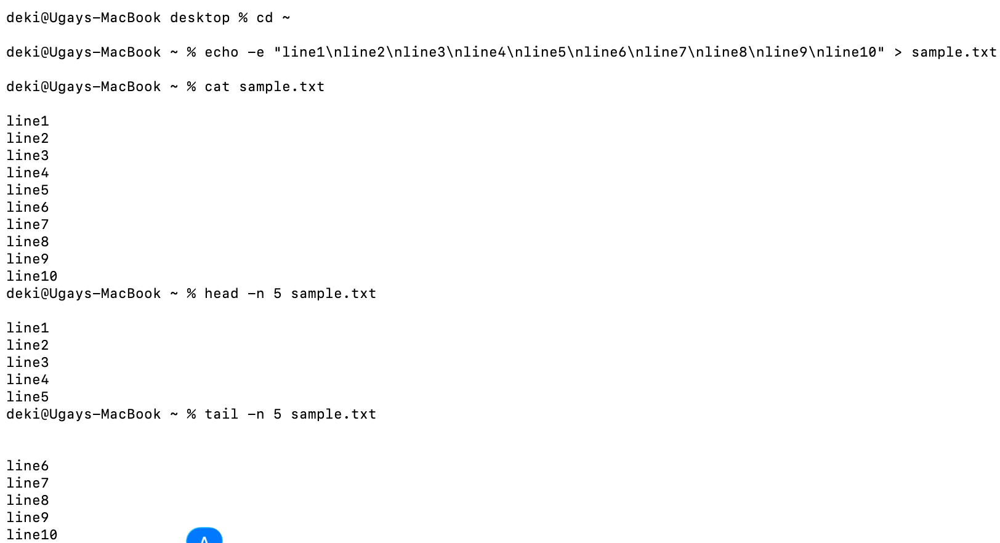
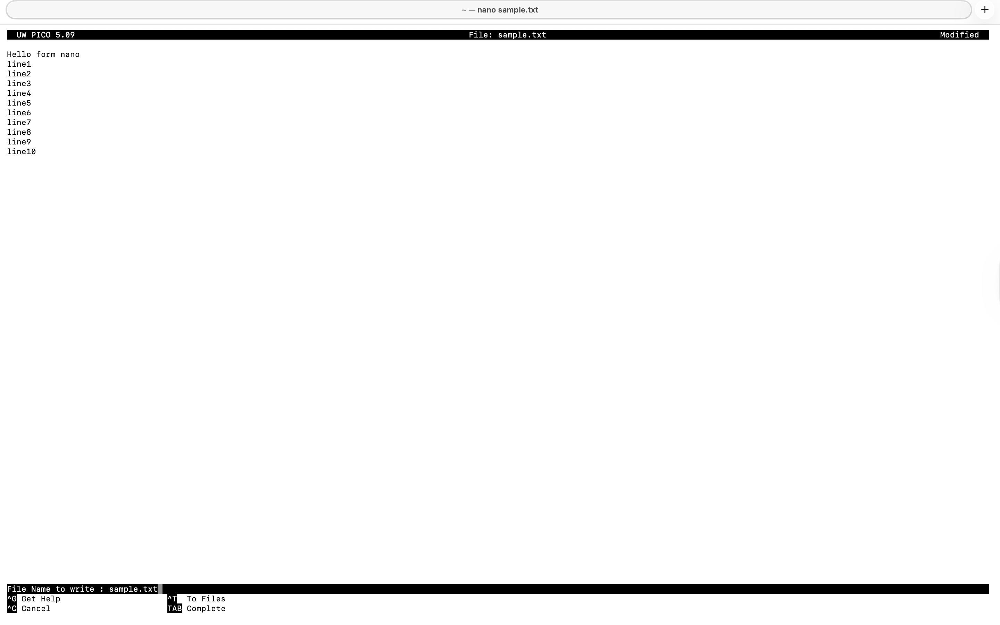
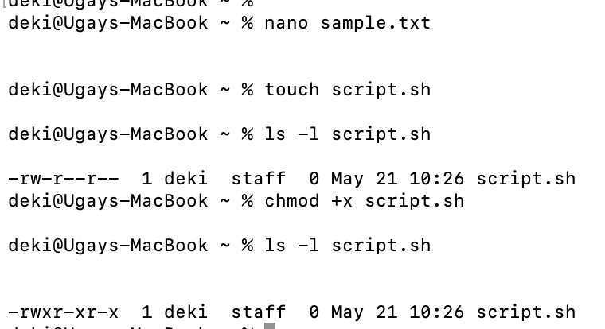
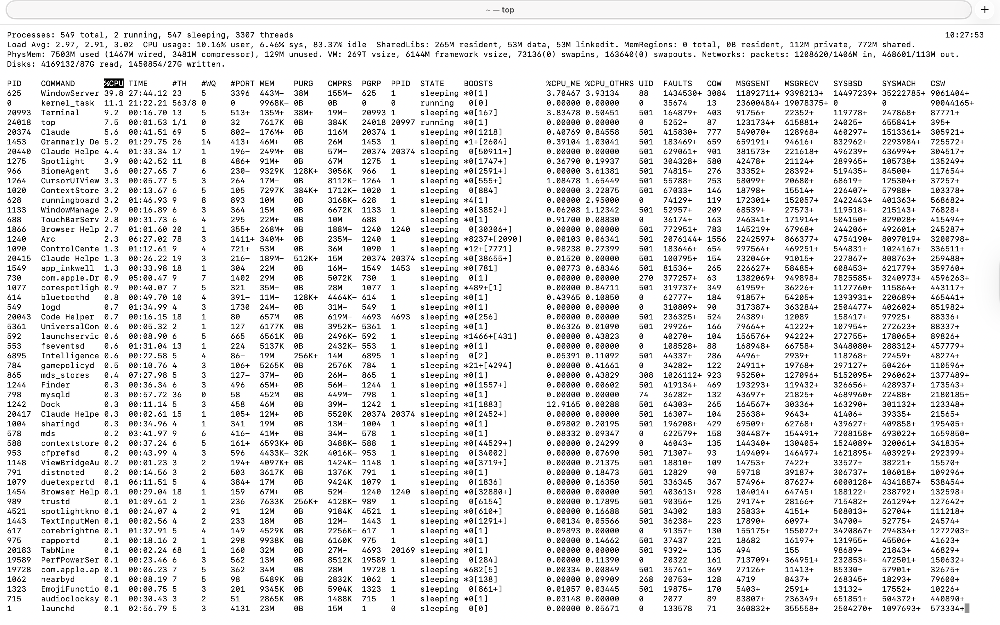
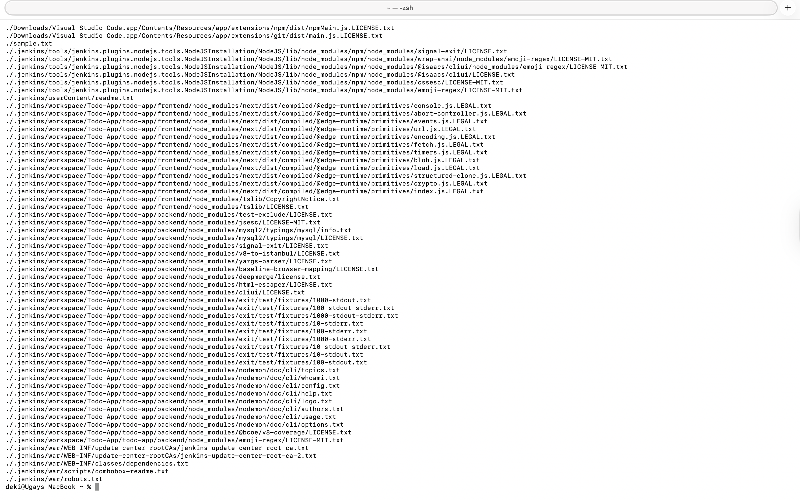
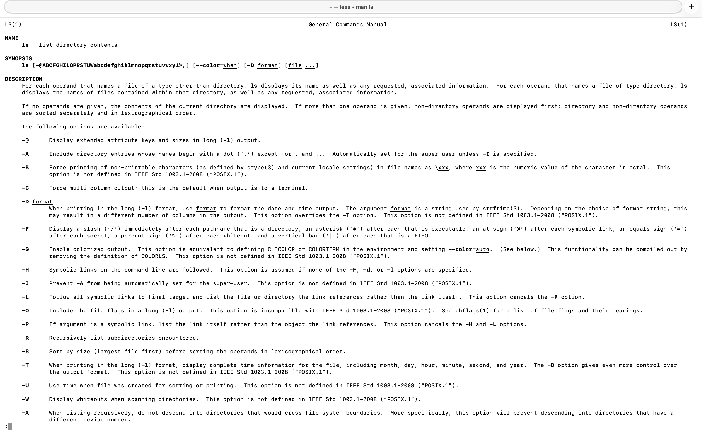
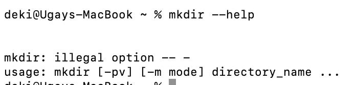

# DSO101 - Practical 1: Linux Commands

**Name:** UgayNobu | **Student ID:** 02240369 | **Course:** DSO101

---

## Task 1: Navigation and File Management

### Step 1: Navigate the Filesystem

Used `pwd`, `ls -la`, and `cd ..` to navigate the Linux filesystem and print the current working directory.

```bash
pwd
ls -la
cd ..
pwd
```



### Step 2: Create Files and Directories

Used `mkdir` to create a new directory and `touch` to create an empty file inside it.

```bash
mkdir my_project
cd my_project
touch notes.txt
ls
```



### Step 3: Copy, Move, and Delete

Used `cp` to copy, `mv` to rename, `rm` to delete a file, and `rmdir` to remove an empty directory.

```bash
mkdir backup
cp notes.txt backup/
ls backup/
mv notes.txt renamed.txt
ls
rm renamed.txt
ls
cd ..
rm my_project/backup/notes.txt
rmdir my_project/backup
```



---

## Task 2: Reading, Editing, and Permissions

### Step 4: Read File Content

Used `echo` to create a sample file, then `cat`, `head`, and `tail` to read its contents in different ways.

```bash
echo -e "line1\nline2\nline3\nline4\nline5\nline6\nline7\nline8\nline9\nline10" > sample.txt
cat sample.txt
head -n 5 sample.txt
tail -n 5 sample.txt
```



### Step 5: Edit Files with nano

Used `nano` to open and edit `sample.txt` directly in the terminal, adding a new line at the top, then saved with `Ctrl+O` and exited with `Ctrl+X`.

```bash
nano sample.txt
# Ctrl+O → Enter to save
# Ctrl+X to exit
```



### Step 6: File Permissions

Used `touch` to create a shell script, then `ls -l` to view permissions before and after using `chmod +x` to make it executable.

```bash
touch script.sh
ls -l script.sh
chmod +x script.sh
ls -l script.sh
```



---

## Task 3: System Monitoring and Search

### Step 7: Monitor System Resources

Used `top` to view real-time CPU and process usage on the system.

```bash
top
# Press q to quit
```



### Step 8: Search and Filter

Used `find` to search for all `.txt` files recursively from the home directory.

```bash
find . -name "*.txt"
```



### Step 9: Getting Help

Used `man ls` to view the full manual page for the `ls` command, and `mkdir --help` to see a quick usage summary.

```bash
man ls
# Press q to exit
mkdir --help
```





---

## Results

| Task | Step | Command(s) | Status |
|------|------|------------|--------|
| Task 1 | Step 1 | `pwd`, `ls -la`, `cd` | ✅ |
| Task 1 | Step 2 | `mkdir`, `touch`, `ls` | ✅ |
| Task 1 | Step 3 | `cp`, `mv`, `rm`, `rmdir` | ✅ |
| Task 2 | Step 4 | `cat`, `head`, `tail` | ✅ |
| Task 2 | Step 5 | `nano` | ✅ |
| Task 2 | Step 6 | `chmod`, `ls -l` | ✅ |
| Task 3 | Step 7 | `top` | ✅ |
| Task 3 | Step 8 | `find` | ✅ |
| Task 3 | Step 9 | `man`, `--help` | ✅ |

---

## Reflection

This practical introduced me to the Linux command line interface and its core commands. I learned how to navigate the filesystem using `pwd`, `ls`, and `cd`, and how to manage files and directories with `mkdir`, `touch`, `cp`, `mv`, `rm`, and `rmdir`. One challenge I faced was using `rmdir` on a non-empty directory — it failed because `rmdir` only removes empty directories. I solved this by first deleting the file inside with `rm` before running `rmdir`. I also learned how file permissions work in Linux and how `chmod +x` makes a script executable, which I could clearly see in the permission string changing from `-rw-r--r--` to `-rwxr-xr-x`. Overall, this practical gave me a solid foundation in Linux CLI operations that will be essential for DevOps workflows.

---

## References

- Linux Command Line Guide — DSO101 Class Material (`Linux_Commands.pdf`)
- [Linux man pages](https://man7.org/linux/man-pages/)
- [GNU Bash Manual](https://www.gnu.org/software/bash/manual/)
