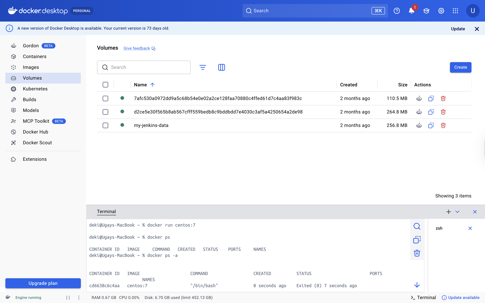
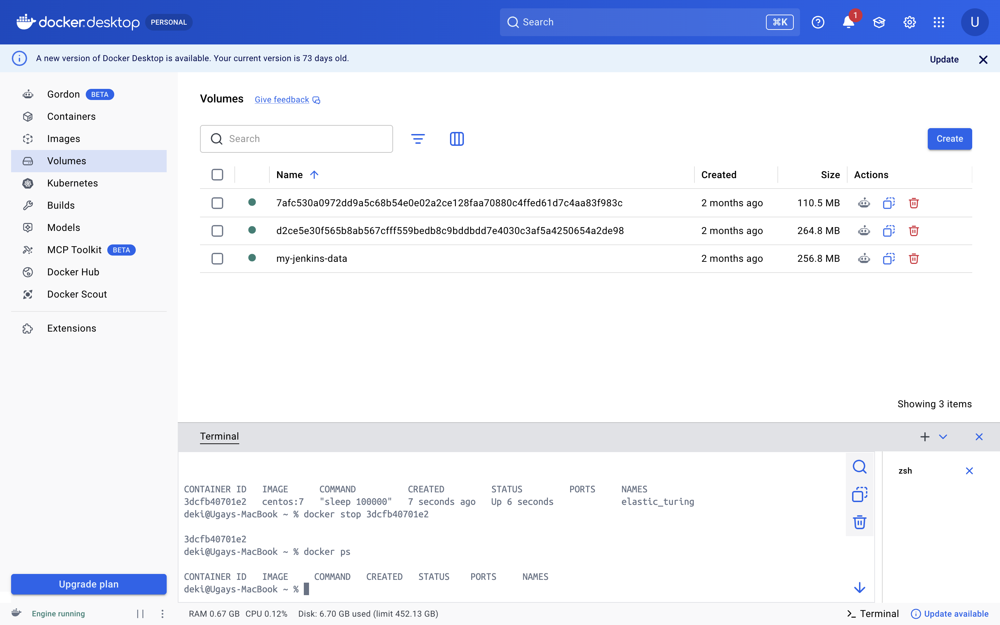
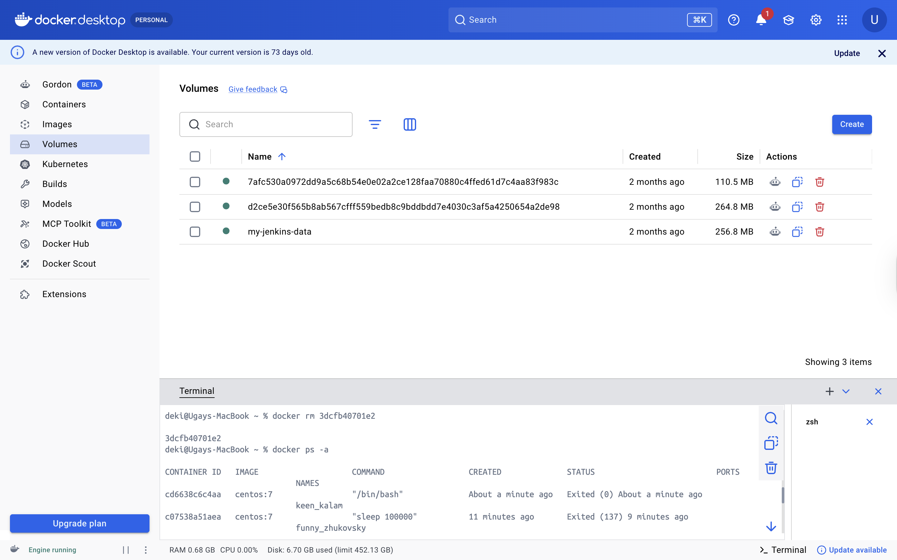
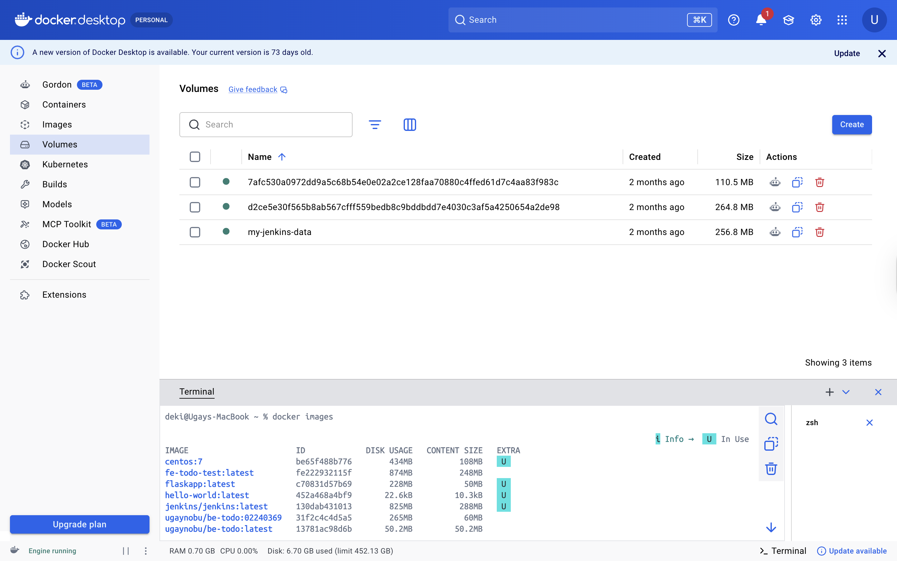
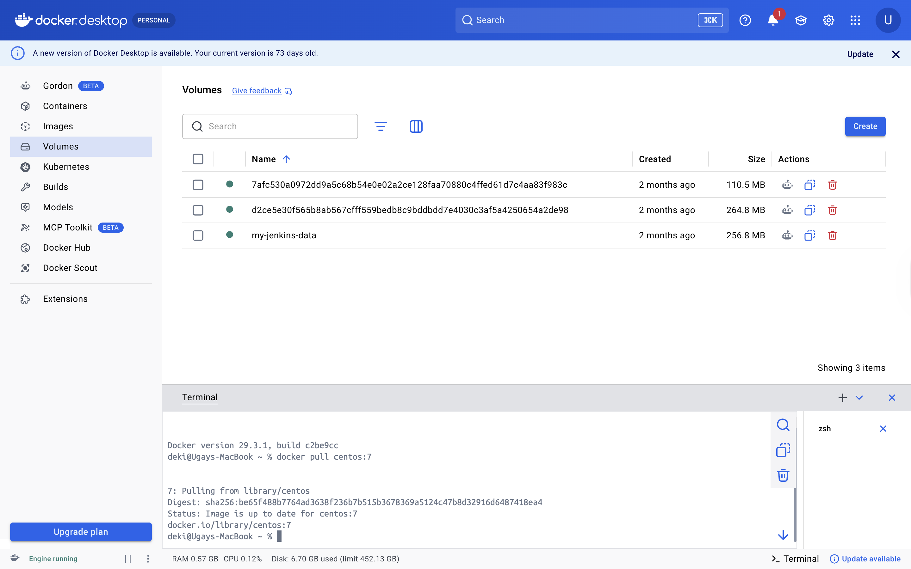
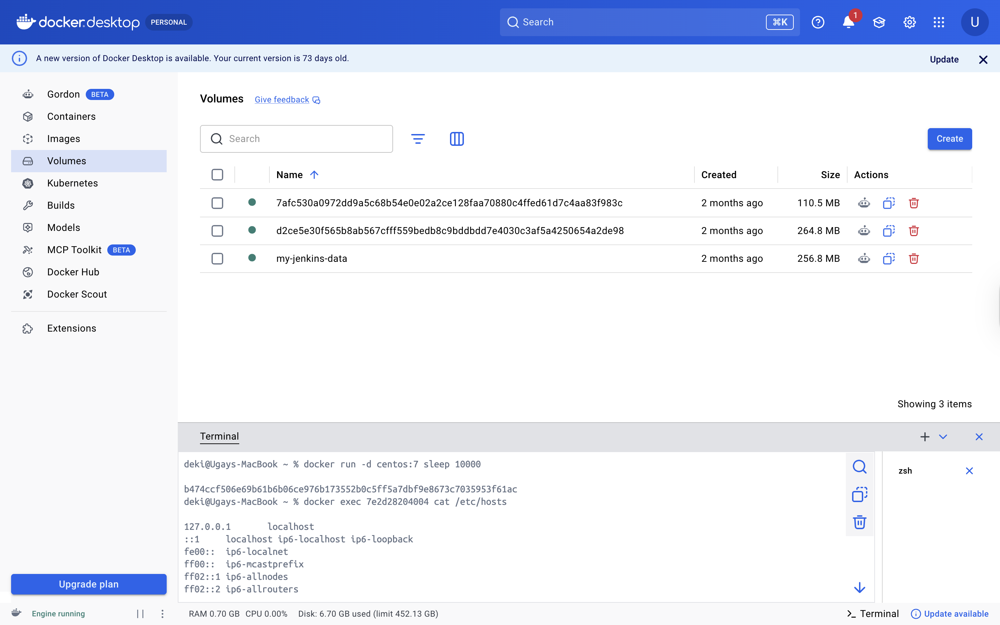
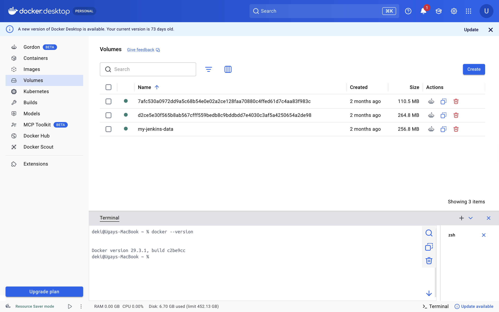
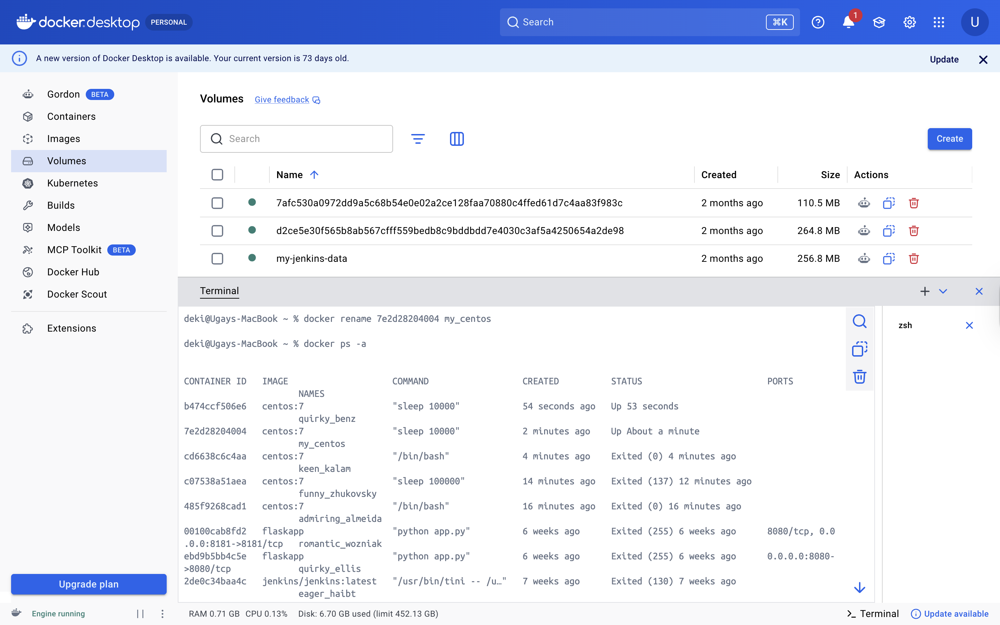
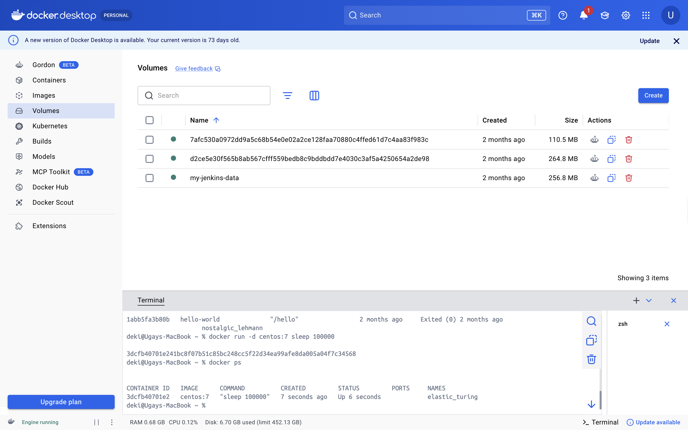
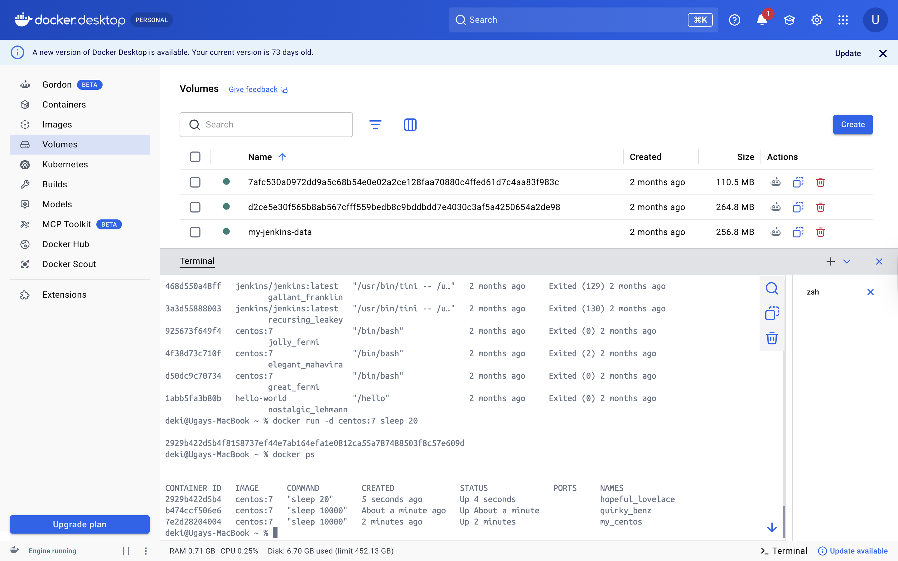

# DSO101 - Practical 2: Basic Docker Commands

**Name:** UgayNobu | **Student ID:** 02240369 | **Course:** DSO101

---

## Task 1: Basic Docker Commands

### Objective

The objective of this practical was to learn the basic Docker commands used to run containers, list containers, stop and remove containers, manage images, inspect container files, and run containers in detached mode.

### Step 1: Start a Container

A CentOS 7 container was started using the `docker run` command.

```bash
docker run centos:7
```



### Step 2: List Running and All Containers

Docker containers were listed using `docker ps` and `docker ps -a`.

```bash
docker ps
docker ps -a
```


### Step 3: Stop a Container

A running container was stopped using the container ID or container name.

```bash
docker stop <container_id>
```



### Step 4: Remove a Container

A stopped container was removed using the `docker rm` command.

```bash
docker rm <container_id>
```



### Step 5: Show Docker Images

Available Docker images on the local system were displayed.

```bash
docker images
```



### Step 6: Remove Docker Image

A Docker image was removed after stopping and deleting the container using it.

```bash
docker rmi <image_name>
```

### Step 7: Pull Docker Images

An image was downloaded from Docker Hub using the `docker pull` command.

```bash
docker pull centos:7
```



### Step 8: Inspect Container File Contents

The `/etc/hosts` file inside a container was viewed without opening an interactive shell.

```bash
docker exec <container_id> cat /etc/hosts
```



### Step 9: Show Docker Version

The installed Docker version was checked.

```bash
docker --version
```



### Step 10: Rename a Container

A container was renamed using the `docker rename` command.

```bash
docker rename <old_name> <new_name>
```



### Step 11: Run a Container in Detached Mode

A container was started in detached mode so that it could run in the background.

```bash
docker run -d centos:7 sleep 100000
```



### Step 12: Run a Container for a Specific Time

A container was run for 20 seconds using the `sleep` command.

```bash
docker run -d centos:7 sleep 20
```



---

## Results

| Step | Command(s) | Status |
|------|------------|--------|
| Step 1 | `docker run centos:7` | ✅ |
| Step 2 | `docker ps`, `docker ps -a` | ✅ |
| Step 3 | `docker stop <container_id>` | ✅ |
| Step 4 | `docker rm <container_id>` | ✅ |
| Step 5 | `docker images` | ✅ |
| Step 6 | `docker rmi <image_name>` | ✅ |
| Step 7 | `docker pull centos:7` | ✅ |
| Step 8 | `docker exec <id> cat /etc/hosts` | ✅ |
| Step 9 | `docker --version` | ✅ |
| Step 10 | `docker rename <old> <new>` | ✅ |
| Step 11 | `docker run -d centos:7 sleep 100000` | ✅ |
| Step 12 | `docker run -d centos:7 sleep 20` | ✅ |

---

## Reflection

From this practical, I learned how Docker containers and images are managed using common Docker CLI commands. I also understood that images must be pulled or built first, containers are created from images, and containers should be stopped and removed before removing related images. Running containers in detached mode using `-d` was particularly useful as it allows containers to run in the background without blocking the terminal.

---

## References

- Docker Introduction — DSO101 Class Material (`Docker_Introduction.pdf`)
- [Docker Official Documentation](https://docs.docker.com/)
- [Docker Hub - CentOS](https://hub.docker.com/_/centos)