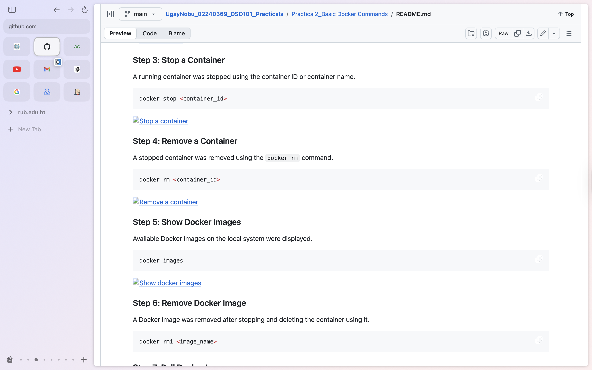
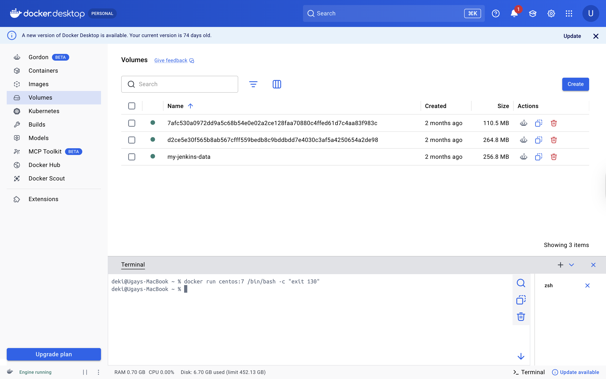
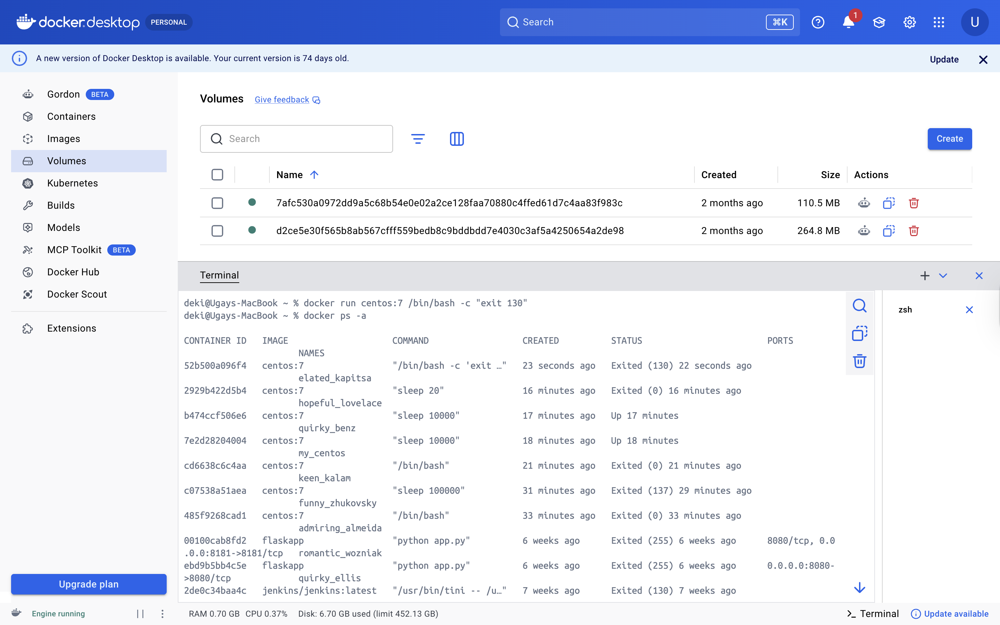
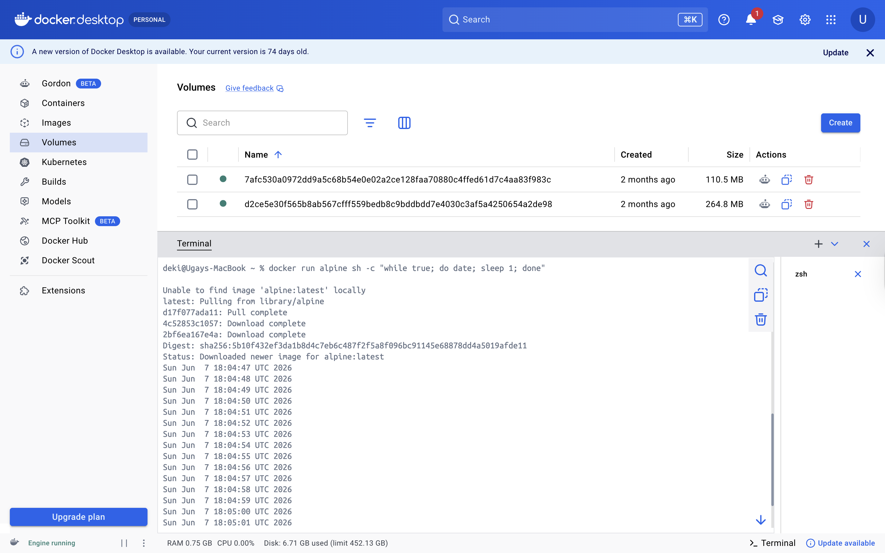

# Practical 3: Docker Tasks

**Student Name:** UgayNobu  
**Student ID:** 02240369  
**Module:** DSO101 - Continuous Integration and Continuous Deployment

---

## Objective

The objective of this practical was to practice specific Docker container tasks, including running a container with a custom exit code and creating a simple timer inside a container.

---

## Task 1: Stop a Docker Container with Exit Code 130

### Step 1: Run the CentOS Container with Exit Code 130

A CentOS 7 container was run with a command that exits using exit code `130`.

```bash
docker run centos:7 /bin/bash -c "exit 130"
```



### Step 2: Verify the Exit Code

The exit code was verified by listing all containers including stopped ones.

```bash
docker ps -a
```



The STATUS column confirms the container exited with code `130`.



---

## Task 2: Create a Timer in Docker

### Step 1: Run the Alpine Timer Container

An Alpine container was used to print the current date and time every second using a shell loop.

```bash
docker run alpine sh -c "while true; do date; sleep 1; done"
```



The container pulled the Alpine image and began printing a timestamp every second. The loop was stopped with `Ctrl+C`.

---

## Results

| Task | Command | Expected Result | Status |
|------|---------|-----------------|--------|
| Run container with exit code 130 | `docker run centos:7 /bin/bash -c "exit 130"` | Container exits silently | ✅ |
| Verify exit code with docker ps -a | `docker ps -a` | STATUS shows `Exited (130)` | ✅ |
| Run Alpine timer | `docker run alpine sh -c "while true; do date; sleep 1; done"` | Timestamps printed every second | ✅ |

---

## Reflection

This practical helped me understand that Docker containers can run custom shell commands on startup using the `/bin/bash -c` or `sh -c` syntax. Exit codes are important because they tell us how a container stopped — exit code `130` specifically means the process was interrupted, which is useful for debugging. The Alpine timer task showed how lightweight containers like Alpine can run continuous shell scripts efficiently. These concepts are foundational for writing automation scripts and health checks inside containers.

---

## References

- Docker CLI Reference: https://docs.docker.com/engine/reference/commandline/run/
- Docker Hub - CentOS: https://hub.docker.com/_/centos
- Docker Hub - Alpine: https://hub.docker.com/_/alpine
- Linux Exit Codes: https://tldp.org/LDP/abs/html/exitcodes.html