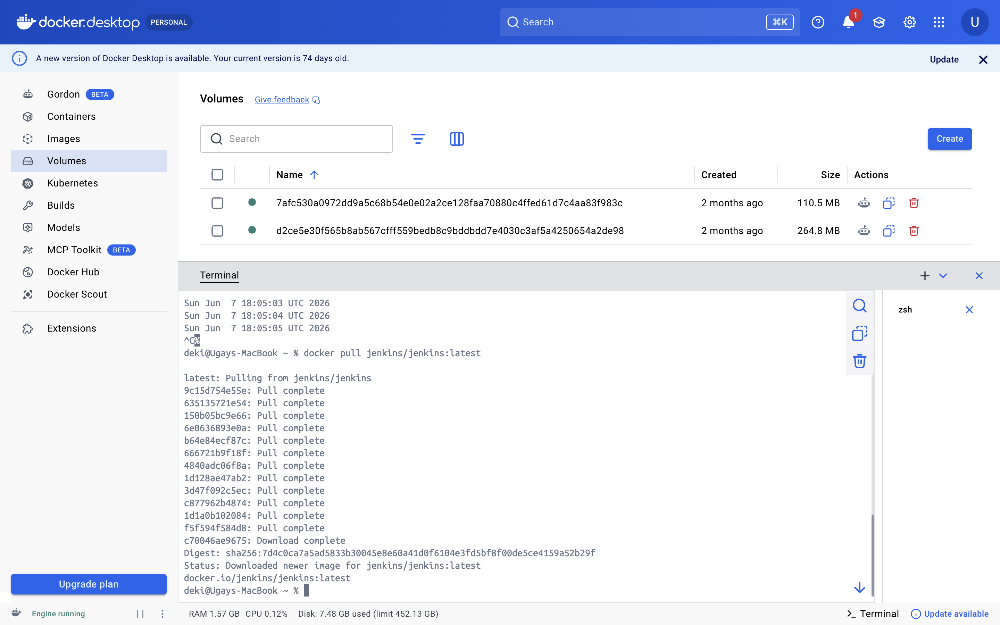
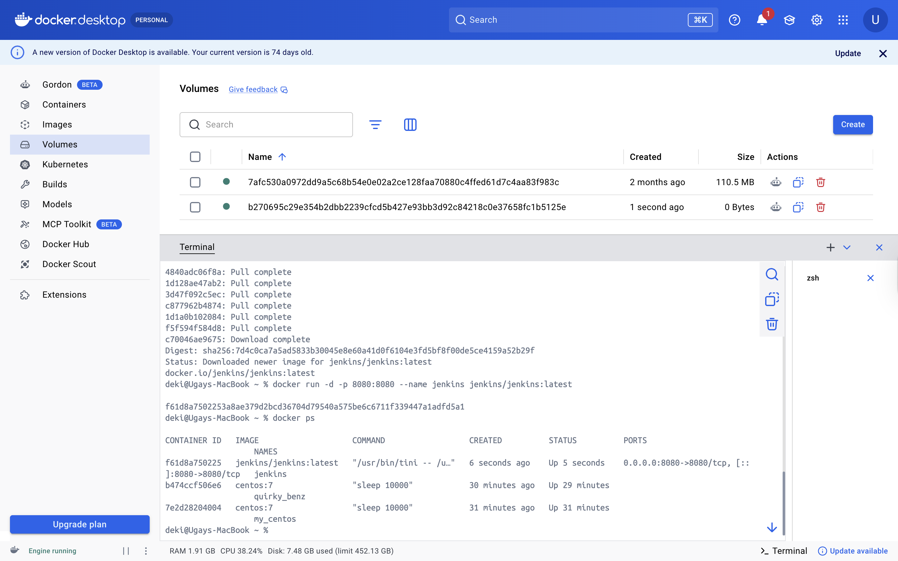
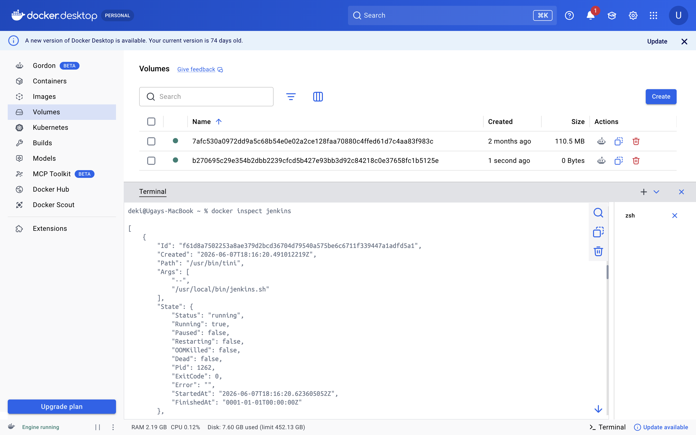
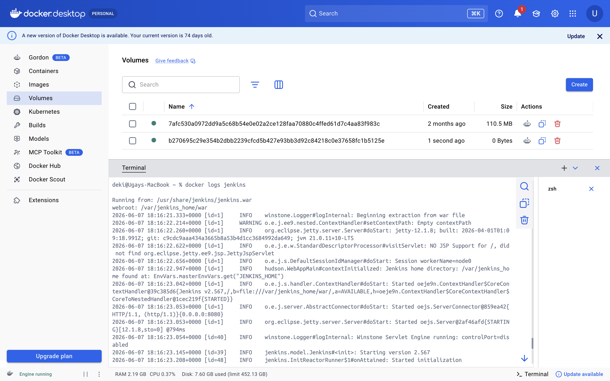
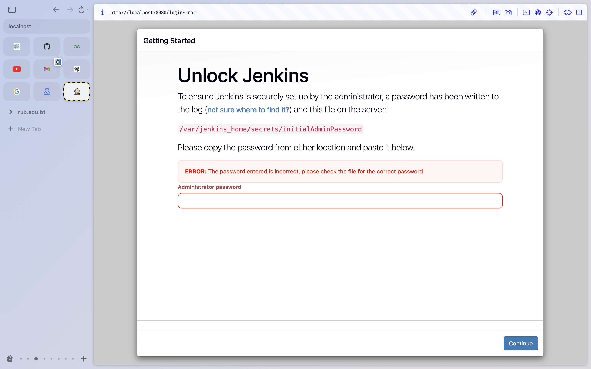

# Practical 4: Jenkins

**Student Name:** UgayNobu  
**Student ID:** 02240369  
**Module:** DSO101 - Continuous Integration and Continuous Deployment

---

## Objective

The objective of this practical was to pull and run Jenkins using Docker, inspect the container details, map Jenkins to port `8080`, and open Jenkins in the browser for installation.

---

## Task 1: Pull Jenkins Image

### Step 1: Pull the Jenkins Docker Image

The Jenkins image was pulled from Docker Hub using the following command.

```bash
docker pull jenkins/jenkins:latest
```



The terminal shows all layers being pulled and confirms the image was downloaded successfully with the digest and status message.

---

## Task 2: Check If Jenkins Container Is Running

### Step 1: Run Jenkins in Detached Mode and Check Status

Jenkins was started in detached mode with port mapping, then `docker ps` was used to confirm it was running.

```bash
docker run -d -p 8080:8080 --name jenkins jenkins/jenkins:latest
docker ps
```



The `docker ps` output confirms the Jenkins container is running with `STATUS: Up` and port `0.0.0.0:8080->8080/tcp`.

---

## Task 3: Inspect Container Details

### Step 1: Inspect the Jenkins Container

The Jenkins container was inspected to find details such as port, IP address, and gateway.

```bash
docker inspect jenkins
```



Important details found from the inspect output:

- **Port:** `8080`
- **IP Address:** `172.17.0.4`
- **Gateway:** `172.17.0.1`

---

## Task 4: Perform Port Mapping

### Step 1: View Jenkins Startup Logs and Port Mapping

Jenkins was started with port mapping from the container port `8080` to the host port `8080`. The startup logs were checked to confirm Jenkins was running and to retrieve the initial admin password.

```bash
docker logs jenkins
```



The logs confirm Jenkins started on port `8080` and the initial admin password was generated.

---

## Task 5: Open Jenkins in Browser

### Step 1: Access Jenkins via Browser

Jenkins was opened in the browser using the following URL.

```text
http://localhost:8080
```



The Unlock Jenkins page appeared, requesting the initial admin password found at `/var/jenkins_home/secrets/initialAdminPassword`. The password was retrieved using `docker logs jenkins` and entered to proceed with installation.

---

## Results

| Task | Command | Expected Result | Status |
|------|---------|-----------------|--------|
| Pull Jenkins image | `docker pull jenkins/jenkins:latest` | All layers downloaded | ✅ |
| Run and check container | `docker run -d -p 8080:8080 --name jenkins jenkins/jenkins:latest` | Container running with port 8080 mapped | ✅ |
| Inspect container | `docker inspect jenkins` | IP, Gateway, Port details visible | ✅ |
| View startup logs | `docker logs jenkins` | Jenkins initialized on port 8080 | ✅ |
| Open in browser | `http://localhost:8080` | Unlock Jenkins page displayed | ✅ |

---

## Reflection

This practical gave me hands-on experience running a real CI/CD tool inside Docker. I learned that port mapping (`-p 8080:8080`) is essential for accessing containerized services from the host machine. The `docker inspect` command was useful for verifying network details like IP address and gateway. I also learned that `docker logs` is an important debugging tool — it revealed the Jenkins initial admin password without needing to enter the container. Running Jenkins in detached mode (`-d`) keeps it running in the background, which is the standard approach for services.

---

## References

- Jenkins Docker Hub: https://hub.docker.com/r/jenkins/jenkins
- Docker CLI — docker inspect: https://docs.docker.com/engine/reference/commandline/inspect/
- Docker CLI — docker logs: https://docs.docker.com/engine/reference/commandline/logs/
- Jenkins Getting Started: https://www.jenkins.io/doc/book/getting-started/