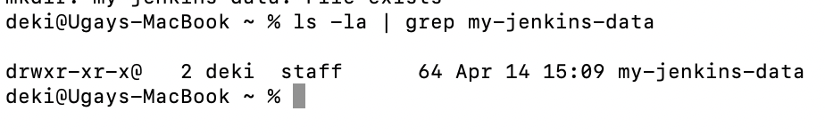
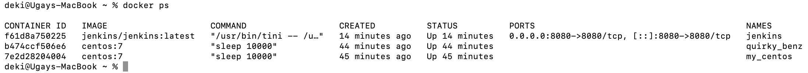
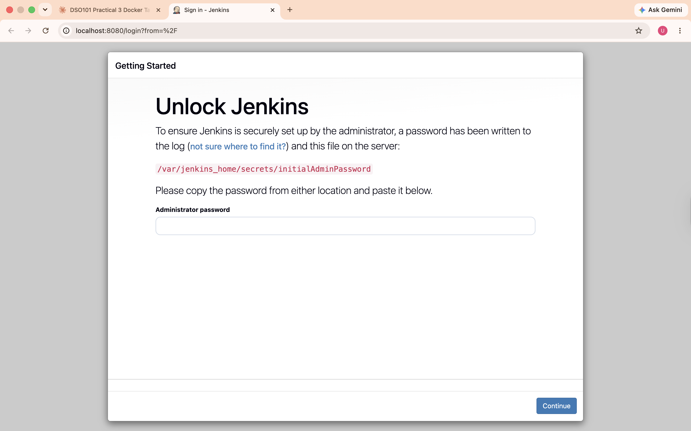
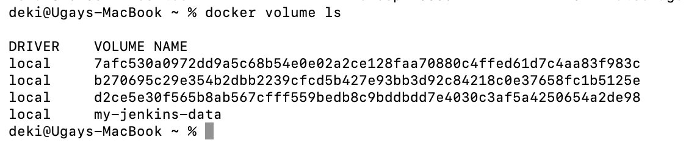
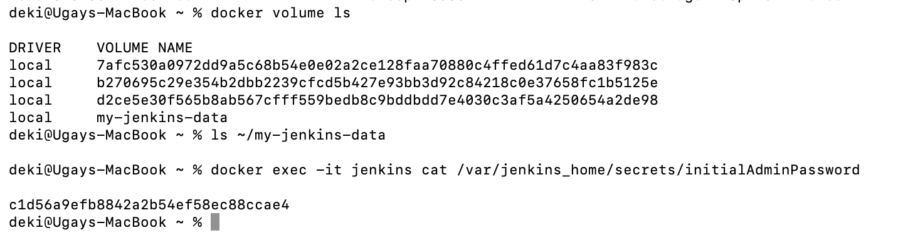
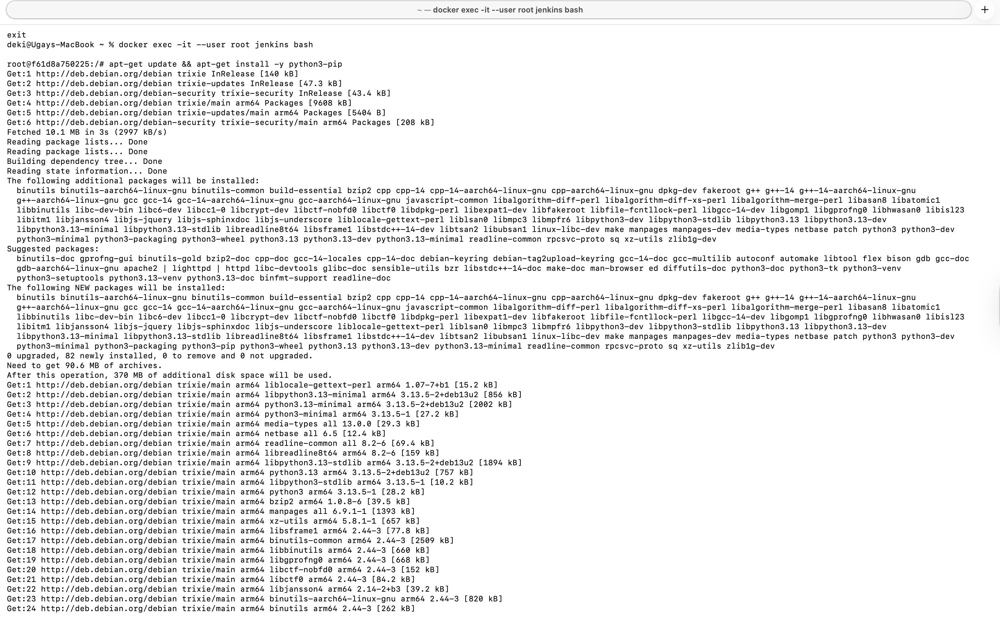
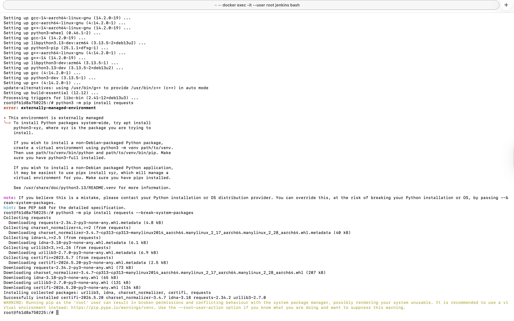

# Practical 5: Data Persistence

**Name:** UgayNobu  
**Student ID:** 02240369  
**Course:** DSO101  

---

## Objective

The objective of this practical was to understand Docker data persistence by storing Jenkins data outside the container using Docker volumes.

---

## Task 1: Create a Local Directory

A local directory was created to store Jenkins data persistently outside the container.

```bash
mkdir my-jenkins-data
ls -la | grep my-jenkins-data
```



---

## Task 2: Perform Port Mapping and Volume Mapping

### Step 1: Run Jenkins with Port and Volume Mapping

Jenkins was started with port mapping (`8080:8080`) and volume mapping to persist data in `my-jenkins-data`.

```bash
docker run -p 8080:8080 -v my-jenkins-data:/var/jenkins_home jenkins/jenkins:latest
```

The running container was verified using:

```bash
docker ps
```



### Step 2: Access Jenkins in Browser

Jenkins was accessed via the browser at `http://localhost:8080`, which displayed the Unlock Jenkins setup page — confirming the container is running and port mapping is working correctly.



### Step 3: Verify the Volume Was Created

The Docker volume `my-jenkins-data` was verified using:

```bash
docker volume ls
```



### Step 4: Confirm Data Persistence

The Jenkins initial admin password was read directly from the volume to confirm data is being stored persistently inside the named volume:

```bash
ls ~/my-jenkins-data
docker exec -it jenkins cat /var/jenkins_home/secrets/initialAdminPassword
```



---

## Task 3: Install Python Libraries and Packages

### Step 1: Install Python Inside the Container

Since the Jenkins image does not include Python by default, Python and pip were installed inside the container by accessing it as root:

```bash
docker exec -it --user root jenkins bash
apt-get update && apt-get install -y python3-pip
```



### Step 2: Install the requests Library

After Python was installed, the `requests` library was installed using pip:

```bash
python3 -m pip install requests --break-system-packages
```



---

## Results

| Task | Description | Status |
|------|-------------|--------|
| Task 1 | Created local directory `my-jenkins-data` | ✅ |
| Task 2 | Ran Jenkins with port and volume mapping | ✅ |
| Task 2 | Accessed Jenkins at `localhost:8080` | ✅ |
| Task 2 | Verified volume `my-jenkins-data` created | ✅ |
| Task 2 | Confirmed data persistence via `initialAdminPassword` | ✅ |
| Task 3 | Installed `python3-pip` inside container | ✅ |
| Task 3 | Installed `requests` library via pip | ✅ |

---

## Reflection

This practical taught me how Docker handles data persistence using volumes. By default, containers are stateless — any data inside is lost when the container stops or is removed. By mapping a Docker named volume (`my-jenkins-data`) to the Jenkins home directory (`/var/jenkins_home`), all Jenkins configuration, plugins, and secrets were stored outside the container and persisted across restarts.

I also learned that Docker images are purpose-built and may not include tools like Python by default. Installing `python3-pip` inside the Jenkins container demonstrated how containers can be extended at runtime, and how the `--break-system-packages` flag is sometimes needed in Debian-based environments managed by system package tools.

---

## References

- [Docker Volumes Documentation](https://docs.docker.com/storage/volumes/)
- [Jenkins Docker Image](https://hub.docker.com/r/jenkins/jenkins)
- [pip install documentation](https://pip.pypa.io/en/stable/cli/pip_install/)