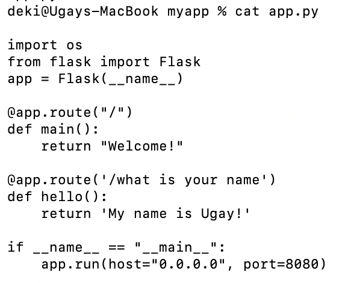
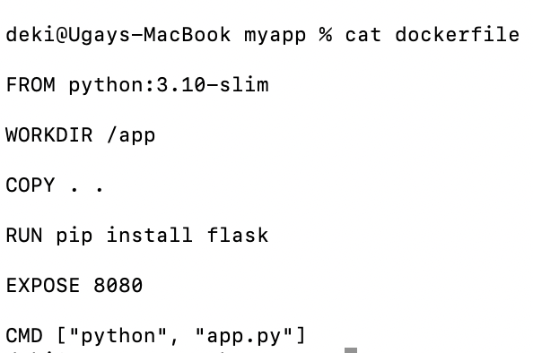
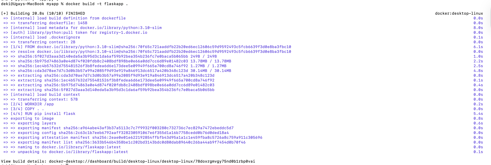
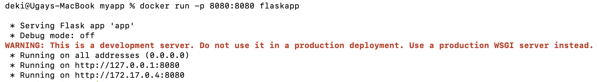
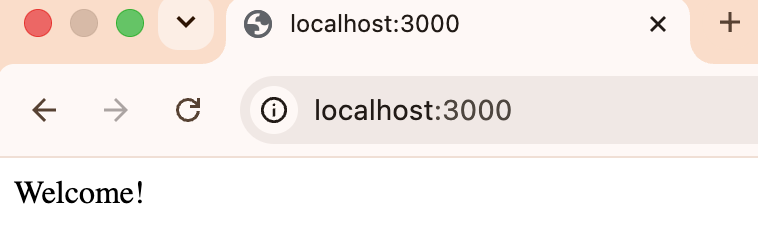
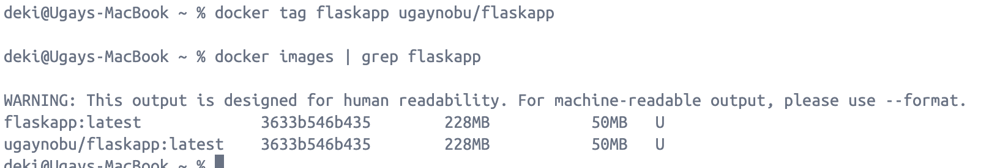
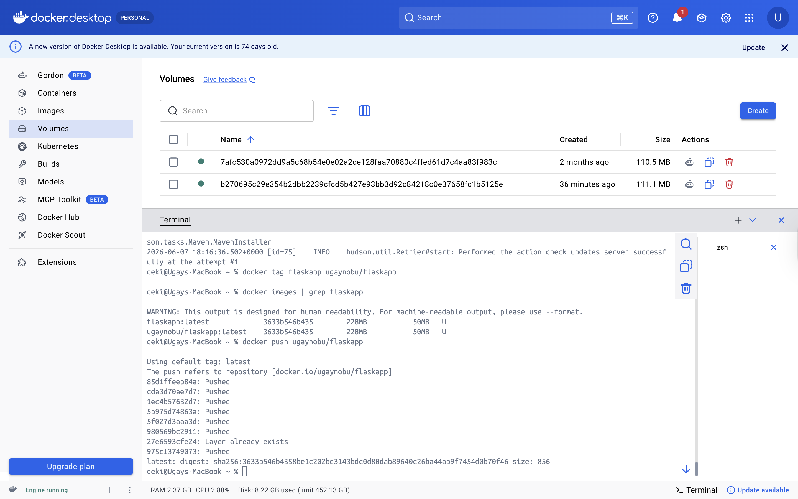

# Practical 6: Building Image

**Name:** UgayNobu  
**Student ID:** 02240369  
**Course:** DSO101  

---

## Objective

The objective of this practical was to create a simple web server application, build a Docker image for it, run the image as a container, and push the image to Docker Hub.

---

## Task 1: Start Web Server

### Step 1: Create the Application File

A Flask web application was created in `app.py` with two routes — a root route returning `Welcome!` and a named route returning `My name is Ugay!`.

```python
import os
from flask import Flask
app = Flask(__name__)

@app.route("/")
def main():
    return "Welcome!"

@app.route('/what is your name')
def hello():
    return 'My name is Ugay!'

if __name__ == "__main__":
    app.run(host="0.0.0.0", port=8080)
```



### Step 2: Create the Dockerfile

A Dockerfile was created to containerize the Flask application using a lightweight Python base image.

```dockerfile
FROM python:3.10-slim

WORKDIR /app

COPY . .

RUN pip install flask

EXPOSE 8080

CMD ["python", "app.py"]
```



### Step 3: Build the Docker Image

The Docker image was built from the Dockerfile using the tag `flaskapp`.

```bash
docker build -t flaskapp .
```



### Step 4: Run the Container

The image was run as a container with port mapping from host port 3000 to container port 8080.

```bash
docker run -p 3000:8080 flaskapp
```



### Step 5: Test the Application in Browser

The running application was accessed in the browser at `http://localhost:3000`, which returned `Welcome!` confirming the Flask app is working correctly inside the container.



---

## Task 2: Push Image to Docker Hub

### Step 1: Tag the Image

The image was tagged with the Docker Hub username `ugaynobu` to prepare it for pushing.

```bash
docker tag flaskapp ugaynobu/flaskapp
docker images | grep flaskapp
```



### Step 2: Push to Docker Hub

The tagged image was pushed to Docker Hub so it can be shared and pulled on any machine.

```bash
docker push ugaynobu/flaskapp
```



---

## Results

| Task | Description | Status |
|------|-------------|--------|
| Task 1 | Created Flask `app.py` with two routes | ✅ |
| Task 1 | Created `Dockerfile` using `python:3.10-slim` | ✅ |
| Task 1 | Built Docker image `flaskapp` successfully | ✅ |
| Task 1 | Ran container with port mapping | ✅ |
| Task 1 | Verified app returns `Welcome!` in browser | ✅ |
| Task 2 | Tagged image as `ugaynobu/flaskapp` | ✅ |
| Task 2 | Pushed image to Docker Hub | ✅ |

---

## Reflection

This practical taught me the full workflow of containerizing an application with Docker — from writing the application code and Dockerfile, to building the image, running it as a container, and publishing it to Docker Hub. I learned that the Dockerfile defines everything the container needs: the base image, working directory, dependencies, exposed port, and the startup command. Port mapping (`-p host:container`) is essential for making the containerized app accessible from the host machine. Pushing to Docker Hub makes the image publicly available so it can be pulled and run on any machine without needing the source code.

---

## References

- [Docker Build Documentation](https://docs.docker.com/engine/reference/commandline/build/)
- [Docker Hub](https://hub.docker.com/)
- [Flask Documentation](https://flask.palletsprojects.com/)
- [Docker run reference](https://docs.docker.com/engine/reference/commandline/run/)