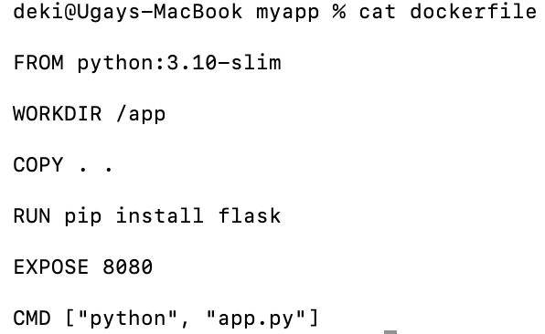
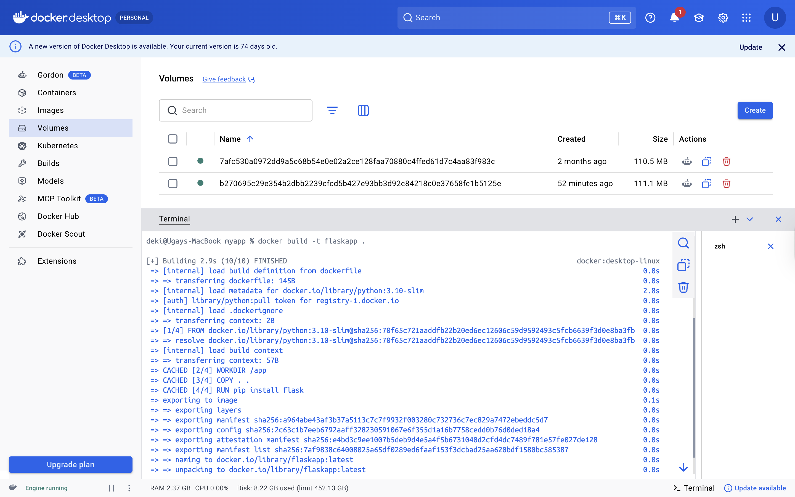
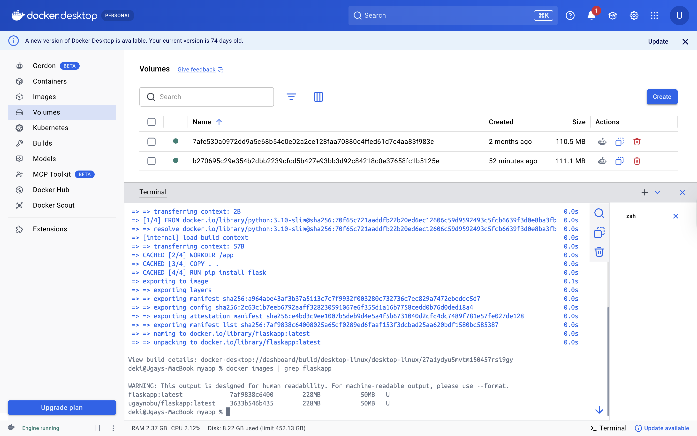

# Practical 7: Dockerfile

**Name:** UgayNobu  
**Student ID:** 02240369  
**Course:** DSO101  

---

## Objective

The objective of this practical was to learn how to write a basic Dockerfile for a Python Flask application and understand what each instruction does.

---

## Task 1: Write and Understand the Dockerfile

### Step 1: View the Dockerfile

The Dockerfile was created inside the `myapp` project folder. Each instruction defines a layer in the final Docker image.

```bash
cat dockerfile
```



### Step 2: Build the Docker Image

The image was built using the `docker build` command. Docker reads the Dockerfile top to bottom and executes each instruction as a layer. Cached layers were reused since the files had not changed.

```bash
docker build -t flaskapp .
```



### Step 3: Verify the Image Was Created

After the build, the image was confirmed to exist locally using:

```bash
docker images | grep flaskapp
```



---

## Dockerfile Explanation

| Instruction | Purpose |
|---|---|
| `FROM python:3.10-slim` | Uses a lightweight Python base image |
| `WORKDIR /app` | Sets the working directory inside the container |
| `COPY . .` | Copies all project files into the container |
| `RUN pip install flask` | Installs Flask during the image build |
| `EXPOSE 8080` | Documents that the app listens on port 8080 |
| `CMD ["python", "app.py"]` | Starts the Flask app when the container runs |

---

## Results

| Task | Description | Status |
|------|-------------|--------|
| Task 1 | Created and reviewed the Dockerfile | ✅ |
| Task 1 | Built Docker image `flaskapp` from Dockerfile | ✅ |
| Task 1 | Verified image exists with `docker images` | ✅ |

---

## Reflection

This practical helped me understand the structure and purpose of a Dockerfile. Each instruction in a Dockerfile represents a step in building the image — starting from a base image, setting up the environment, copying files, installing dependencies, and defining how the container starts. I also observed that Docker uses layer caching, so unchanged steps are reused in subsequent builds, making rebuilds much faster. Writing a Dockerfile makes application deployment consistent and reproducible across any environment.

---

## References

- [Dockerfile Reference](https://docs.docker.com/engine/reference/builder/)
- [Docker Build Documentation](https://docs.docker.com/engine/reference/commandline/build/)
- [Flask Documentation](https://flask.palletsprojects.com/)